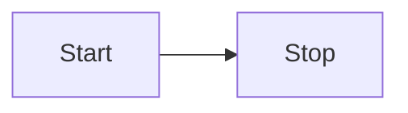

# Getting Started

This section will help you add mermaid support for VitePress.

## Install

```bash
npm i vitepress-plugin-mermaid mermaid -D
```

## Setup it up

Add wrapper

```js
// .vitepress/config.js
import { withMermaid } from "vitepress-plugin-mermaid";

export default withMermaid({
    // your existing vitepress config...
    // optionally, you can pass MermaidConfig
    mermaid: {
      // refer https://mermaid.js.org/config/setup/modules/mermaidAPI.html#mermaidapi-configuration-defaults for options
    },
    // optionally set additional config for plugin itself with MermaidPluginConfig
    mermaidPlugin: {
      class: "mermaid my-class", // set additional css classes for parent container
      panZoomOption: {
        minHeight: '30vh',
        fullEnabled: false,
        // refer https://github.com/bumbu/svg-pan-zoom?tab=readme-ov-file#how-to-use for options
        panEnabled: false,
        zoomEnabled: false,
        // When both zoomEnabled and panEnabled are set to false, 
        // the Pan & Zoom feature will be disabled directly, 
        // and at that time, all the following parameters will become ineffective.
        controlIconsEnabled: true,
        dblClickZoomEnabled: true,
        mouseWheelZoomEnabled: true,
        preventMouseEventsDefault: true,
        zoomScaleSensitivity: 0.2,
        minZoom: 0.5,
        maxZoom: 10,
        fit: true,
        contain: false,
        center: true,
        refreshRate: 'auto',
      }
    },
});
```

Code with ```mmd

```mmd
flowchart LR
  Start --> Stop
```

Visualize with ```mermaid


